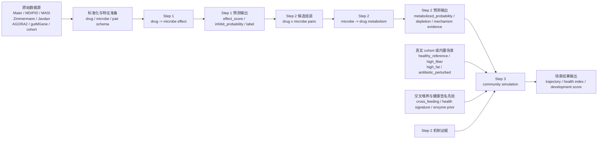
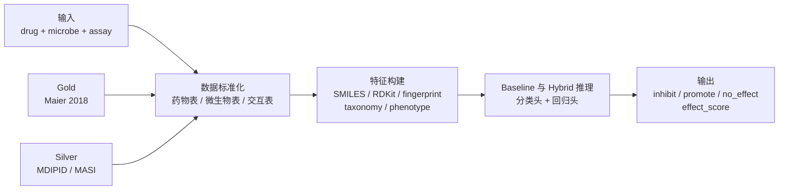
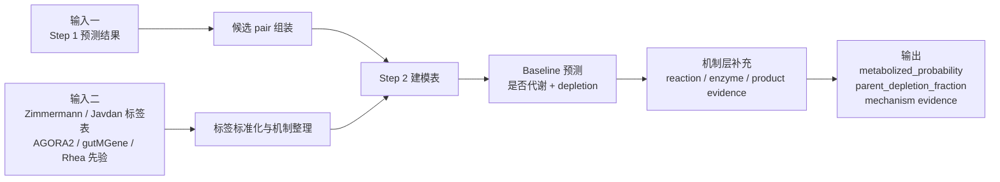
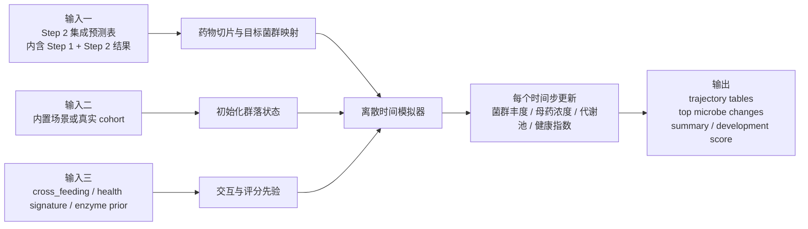

# Step 1 / Step 2 / Step 3 结构图

这份文档把仓库当前的三步主链路整理成可直接复用的结构图，优先对应现有实现，而不是只画概念蓝图。

## 总览结构图

## Step 1 结构图

## Step 2 结构图

## Step 3 结构图9

## 当前代码映射

- Step 1：
  - `scripts/download_step1_data.py`
  - `scripts/normalize_step1_data.py`
  - `scripts/train_step1_baseline.py`
  - `scripts/predict_step1_hybrid.py`
- Step 2：
  - `scripts/normalize_step2_zimmermann.py`
  - `scripts/assemble_step2_inputs.py`
  - `scripts/train_step2_baseline.py`
  - `scripts/predict_step2_baseline.py`
- Step 3：
  - `scripts/run_step3_simulation.py`
  - `scripts/prepare_step3_cohort_community.py`
  - `scripts/screen_step3_candidates.py`

## 一句话理解

- Step 1：先判断“药物怎么影响菌”。
- Step 2：再判断“菌怎么处理药物”。
- Step 3：最后把前两步结果放进群落场景里，模拟“给药后整个系统会怎么变”。
